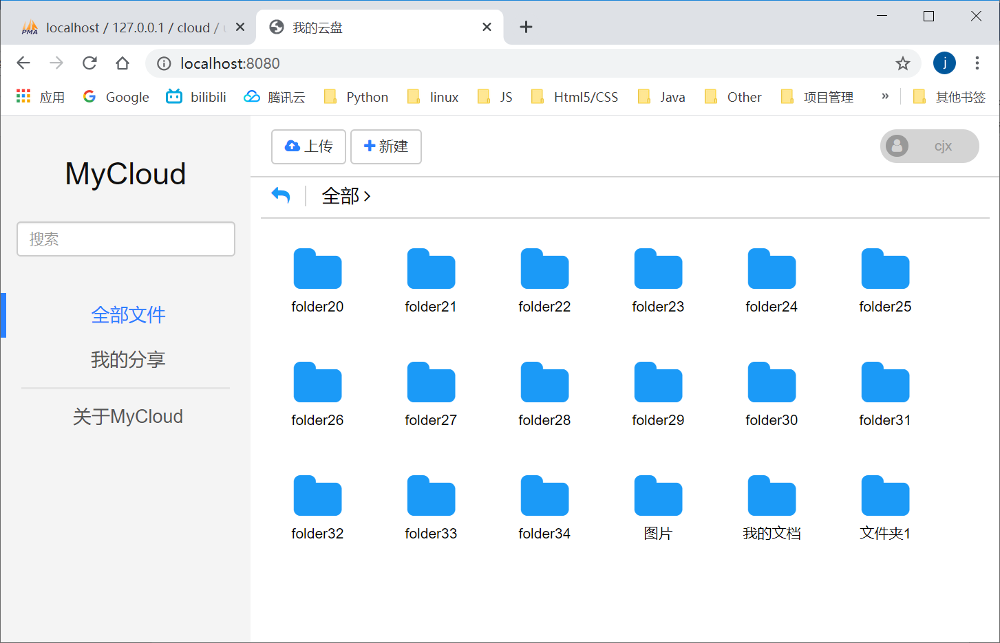

# MyCloud 个人云盘

### 采用了前后端分离的网络架构，前端使用ajax发送包含json格式参数的请求。后端同样使用json格式的数据响应。
### 后端使用SpringBoot Hibernate MySql 编写
### 前端使用JQuery3 font-awesome bootstrap3 jquery.md5.js
 
### 后端分层
| 层级 | 备注 |
| --- | --- |
| interceptor层 | 拦截非法请求（没登陆的请求）|
| controller层 | 处理用户请求 |
| service层	| 整合dao层方法供controller层调用 |
| dao层 | 连接数据库 |
| model层 | 实体类（实体类与数据表对应） |
| utils层 |	工具类（这里我写了一些文件处理的静态方法） |
| vo层 | (value object)将model类的数据包装为前端所需的数据 |

### 数据库设计
#### 用户信息表 user
| 字段名 | 类型 | 长度 | 约束 | 备注 |
| --- | --- | --- | --- | --- |
| user_id |	INT	|  | 主键 | 用户id,自增 |
| user_name	| VARCHAR | 64 | 非空、唯一 | |
| user_password	| BINARY | 16 | 非空	| |
| user_email | INT | 255 | 非空、唯一 | |
| user_phone | CHAR | 11 | | |		
| create_time | DATETIME | | 非空 | 创建时间，自动生成 |

#### 文件信息表 file
| 字段名 | 类型 | 长度 | 约束 | 备注 |
| --- | --- | --- | --- | --- |
| file_id | INT	| | 主键 | 文件id，自增 |
| file_type	| VARCHAR | 16 | 非空 | 文件类型 |
| md5 | BINARY | 16	| 非空 | 文件md5值 |
| path | VARCHAR | 255 | 非空 | 文件储存路径 |
| size | BIGINT | |	非空 | 文件大小（字节） |

#### 用户文件信息表 user_file
| 字段名 | 类型 | 长度 | 约束 | 备注 |
| --- | --- | --- | --- | --- |
| file_id | INT	| | 非空，文件表file的外键，与user_id、folder_id一同为主键 | 文件id |
| user_id | INT	| | 非空，用户表user的外键 | 用户id |
| folder_id | INT | | 非空，文件表file的外键 | 所属文件夹id |
| filename | VARCHAR |255 | 非空 | 文件名 |
| create_time | DATETIME | | 非空 | 创建时间，自动生成 |

#### 文件分享信息表 file_share
| 字段名 | 类型 | 长度 | 约束 | 备注 |
| --- | --- | --- | --- | --- |
| file_id | INT	| |非空，文件表file的外键，与share_user、create_user一同为主键	| 文件id |
| filename | VARCHAR | 255 | 非空 | 文件名 |
| share_user | INT | | 非空，用户表user的外键 | 被分享者的用户id |
| create_user | INT	| | 非空，用户表user的外键 | 分享者的用户id |
| create_time | DATETIME | | 非空 | 创建时间，自动生成 |

### 运行效果
